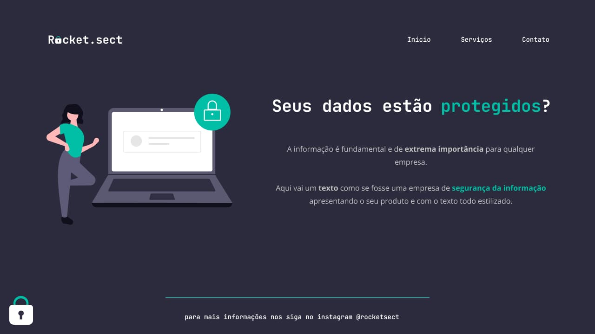

  <a href="#-tecnologias">Tecnologias</a>&nbsp;&nbsp;&nbsp;|&nbsp;&nbsp;&nbsp;
  <a href="#-projeto">Projeto</a>&nbsp;&nbsp;&nbsp;|&nbsp;&nbsp;&nbsp;
  <a href="#-layout">Layout</a>&nbsp;&nbsp;&nbsp;|&nbsp;&nbsp;&nbsp;
  <a href="#memo-licença">License</a>

  

## 🚀 Tecnologias

Esse projeto foi desenvolvido com as seguintes tecnologias:

- HTML e CSS
- Git e Github
- Figma

## 💻 Projeto

Exemplo de um site moderno para uso gratuito.

- [Acesse o projeto finalizado, online](https://alexoab.github.io/stage-02-challege/)

## 🔖 Layout

Você pode visualizar o layout do projeto através [DESSE LINK](https://www.figma.com/file/FAicn1yjwDxyndAZjn9Y7W/Explorer-(Copy)?type=design&node-id=16-106&mode=design&t=FAbCLlyWYS35WVs4-0). É necessário ter conta no [Figma](https://figma.com) para acessá-lo.

## 📝 License

This project is licensed under the MIT License. See the [LICENSE](LICENSE) file for details.

---

Made with  by [Alexoab](https://github.com/alexoab)
